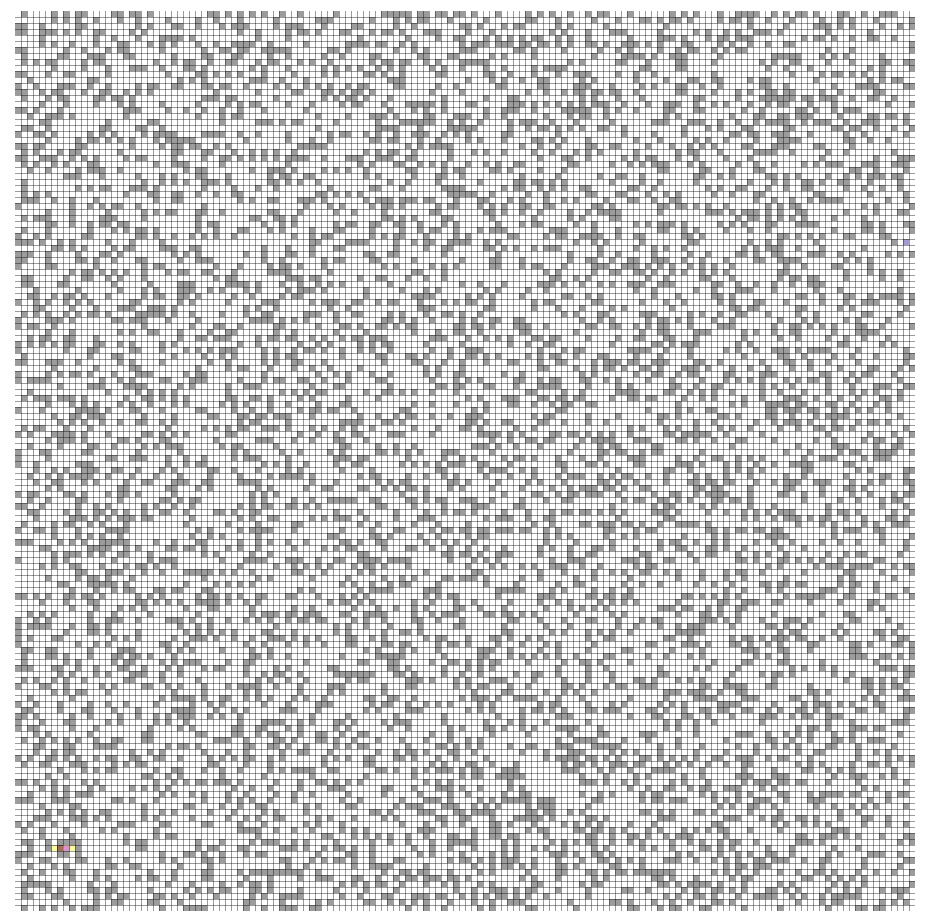

# A-star-Pathfinding

This demo shows how the A* Pathfinding Algorithm can be used for finding the sub-optimal path from one point to another. You can also toggle some settings for viewing experience.

# Controls
* RSHIFT - Frame rate limiter. Due to how I coded it, you can only cap the frame rate lower than your monitor's refresh rate.
* TAB - Current FPS.
* LCLICK - Add walls.
* RCLICK - Erase walls.

# Compiling on Linux (Debian-based)
This project uses CMake in order to generate a make file. Install CMake through whatever means necessary, though the easiest would be using `sudo apt-get install cmake` on the command line. 

In addition to this, you must install the dev versions of [SDL2](https://www.libsdl.org/), [SDL2_image](https://www.libsdl.org/projects/SDL_image/), and [SDL2_ttf](https://www.libsdl.org/projects/SDL_ttf/). On Debian, this can be done by calling `sudo apt-get install libsdl2-dev libsdl2-image-dev libsdl2-ttf-dev`. 

Then, run `git submodule update --init --recursive third-party/` to clone the required submodules onto the project directory. After that, you can compile this project by simply running `compile.bash` to compile an executable into `executable/`. It's as easy as that! 

# Compiling on Arch Linux
To install everything that was said above (and the compilation tools necessary, the command is `pacman -S cmake sdl2 sdl2_image sdl2_ttf base-devel`. After that, follow the same steps as Debian to compile.

# Compiling on Windows
## Requirements
Installing prerequisites on Windows is a bit more complicated. First, download the binary executable of [CMake](https://cmake.org/) and install it. Be sure to install the executable that matches your system architecture.

After that, download all the files listed below. For each one, there should be an `include` and `x86` folder. Merge each one to get a giant `include` and a giant `x86`. Then, in `third-party`, create a folder named `SDL_FULL` and put both the giant `include` and `x86` there. 
* Get the `SDL2-devel-2.0.x` archive from [here](https://www.libsdl.org/release/)
* Get the `SDL2_image-devel-2.0.x` archive from [here](https://www.libsdl.org/projects/SDL_image/release/)
* Get the `SDL2_ttf-devel-2.0.x` archive from [here](https://www.libsdl.org/projects/SDL_ttf/release/)
* For each archive, unzip the contents of their `include` folder into `third-party/SDL_FULL/include` and `lib/x86` folder into `third-party/SDL_FULL/x86`
* Move all the .dll files into a separate folder at the root of the project; This is where your executable will run. 

This project also requires the use of [Tessil/hopscotch-map](https://github.com/Tessil/hopscotch-map). Download the dependency via `git submodule update --init --recursive third-party/`. After that, you're all set!

## Compiling
To compile this project, you need to use CMake and your prefered compiler to generate a x86 (32-bit) version of your solution / executable. 

After this, the compiled executable must be put into ANY folder in the root directory of the project along with the aforementioned .dll files of SDL2. After this, you can run the game :)
